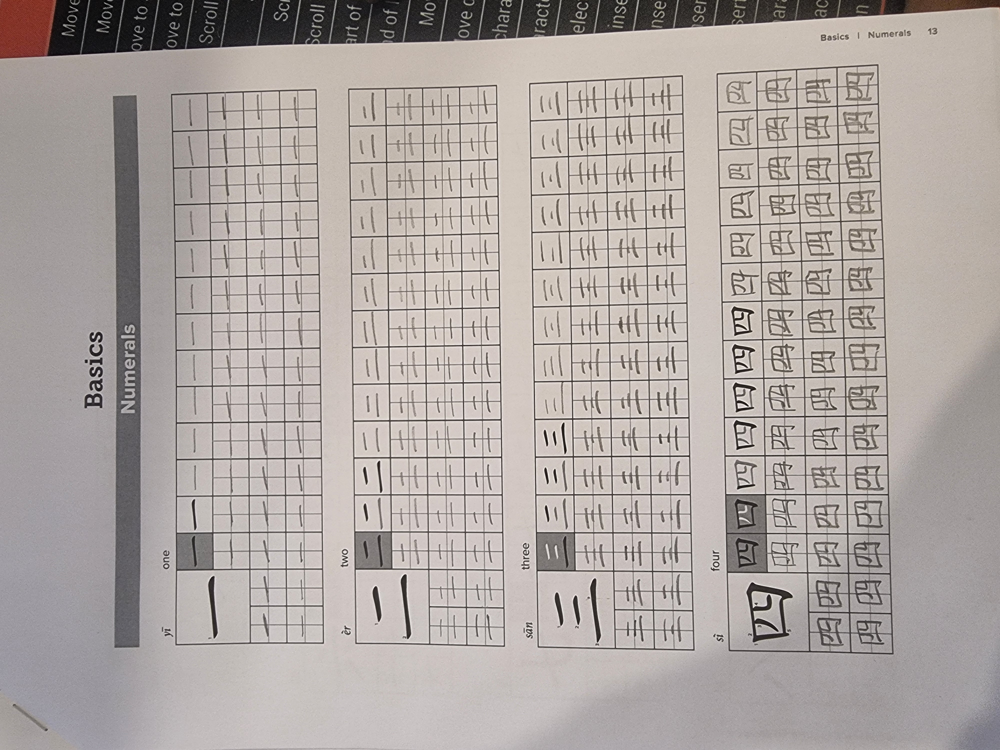
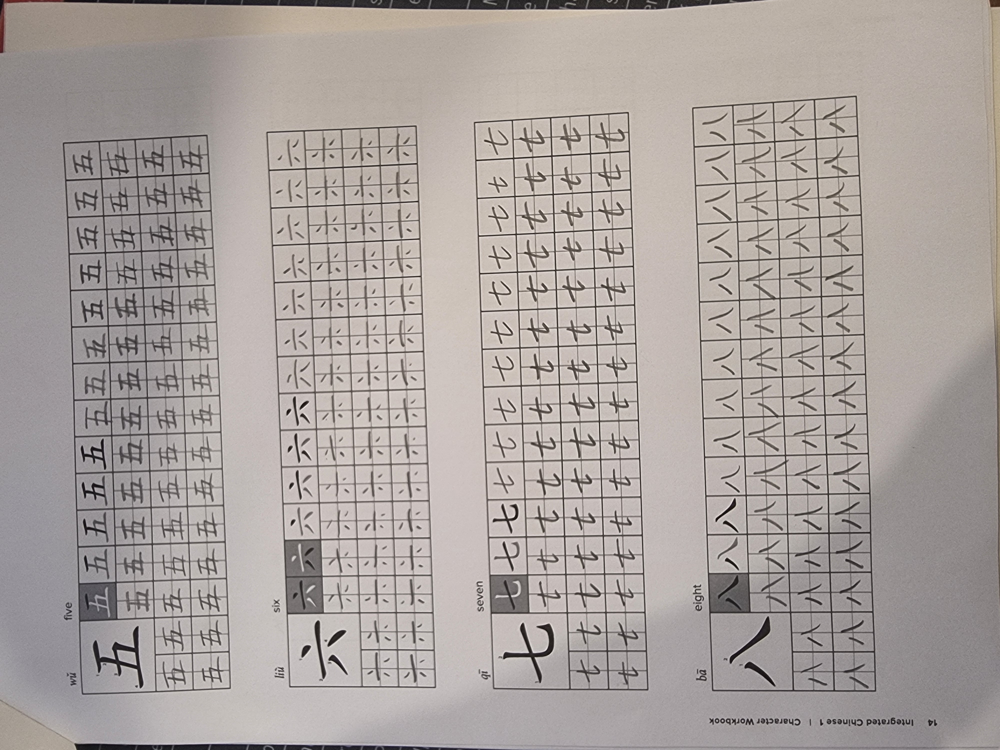
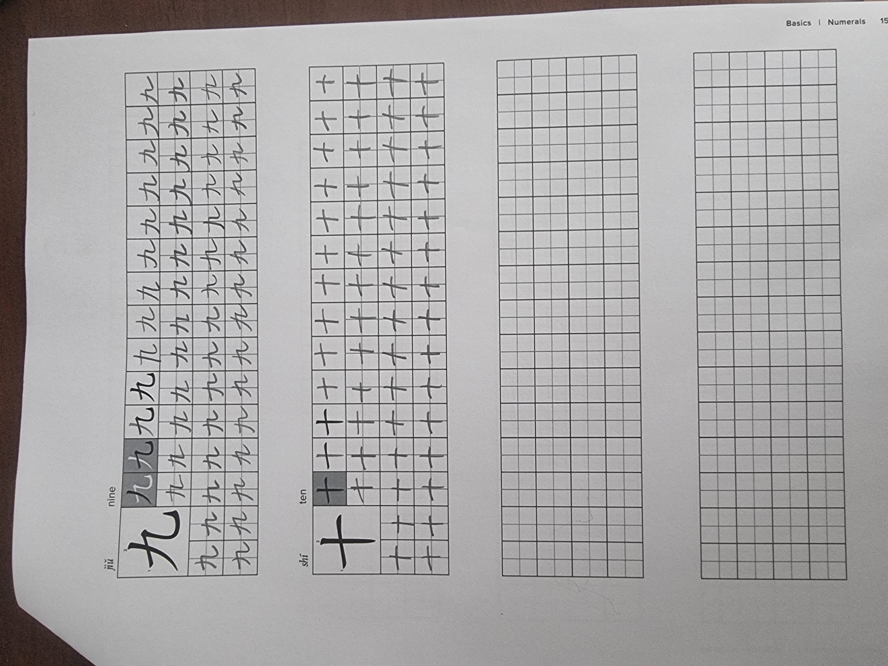

# Homework 1

Everything here is my answers to the worksheet.

Worksheet [download](./homework_1_files/W1-5 Workbook P2-3 Pinyin practice.pdf) 

## A Simple Finals

??? Answers

    1. a
    2. a
    3. a
    4. b
    5. b

## B Initials

??? Answers
    
    1. b
    2. a
    3. b
    4. a
    5. b
    6. a
    7. a
    8. b
    9. b
    10. a
    11. b
    12. b
    13. a
    14. b
    15. a
    16. a
    17. b
    18. b
    19. a
    20. b
    21. a
    22. a
    23. b
    24. b
    25. b

## C Compound Finals

??? Answers
    
    1. b
    2. a
    3. b
    4. a
    5. a
    6. b
    7. a
    8. a
    9. b
    10. a
    11. b
    12. a
    13. a
    14. b
    15. a
    16. a
    17. b
    18. a
    19. a
    20. b
    21. b
    22. a
    23. a
    24. a
    25. a

## D Tones: First and Fourth (Level and Falling)

??? Answers
    
    1. b
    2. a
    3. a
    4. b
    5. b
    6. a
    7. a
    8. b
    9. a
    10. a

## E Tones: Second and Third (Rising and Low)

??? Answers

    1. a
    2. b
    3. b
    4. b
    5. b
    6. a
    7. a
    8. b
    9. a
    10. a

## F All Four Tones

??? Answers

    1. b
    2. b
    3. a
    4. a
    5. b
    6. a
    7. b
    8. b
    9. a
    10. b
    11. b
    12. b
    13. a
    14. b
    15. a
    16. b
    17. a
    18. a
    19. a
    20. b
    21. b
    22. a
    23. b
    24. b
    25. a

## G Comprehensive Exercise

??? Answers

    1. b
    2. a
    3. a
    4. b
    5. b
    6. b
    7. b
    8. a
    9. b
    10. b
    11. b
    12. a
    13. b
    14. b
    15. b
    16. b
    17. a
    18. a
    19. b
    20. a
    21. a
    22. b
    23. b
    24. b
    25. a

## Tone Combination Exercise

This exercise was at the end of page 2 - I have decided to include it into homework 1. It may overlap with homework 2.

### A Multisyllabic Words

??? Answers

    1. first tone
    2. first tone 
    3. second tone
    4. neutral tone
    5. third tone
    6. first tone

## Numbers 1-10

This is practicing writing numbers from 1 to 10. Below is a picture of the worksheet and another picture of the completed worksheet.

## Questions I got wrong

### C
- 10
- 12
- 22

### F
- 2
- 6
- 10
- 13
- 15

### G 
- 1
- 7
- 8
- 14
- 19

## Textbook Review

If you haven’t already, please get the Integrated Chinese 4th Edition textbook. Review pp. 3–7, paying close attention to tricky pronunciation such as q, x, zh, ch, an, ang, or üan

## Self-Introduction

Review the sentence pattern 我叫__Given_Name__ and be ready to introduce yourself in class.

## Writing Practice

Use the attached worksheet to practise writing numbers in Chinese. The worksheet can be seen [here](./homework_1_files/Numbers 1-10.pdf)

Below is my completed writing practice.

