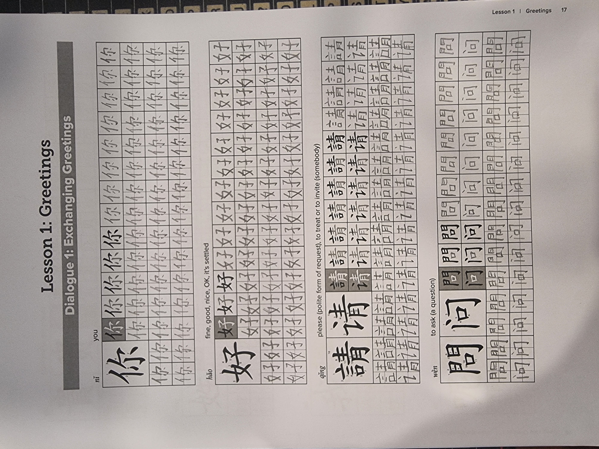
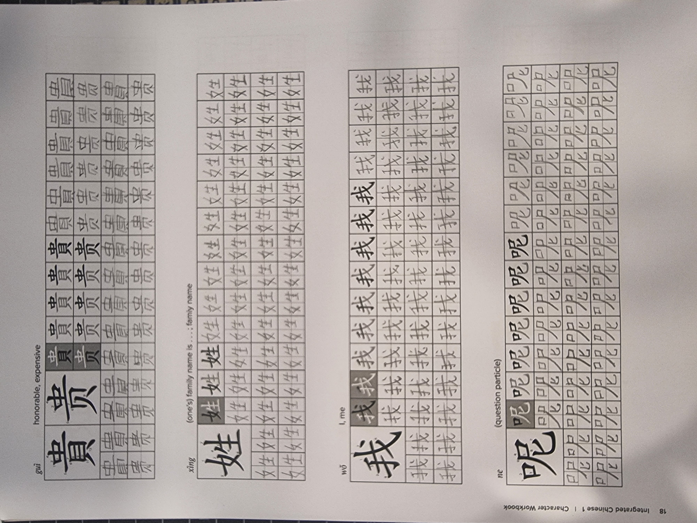
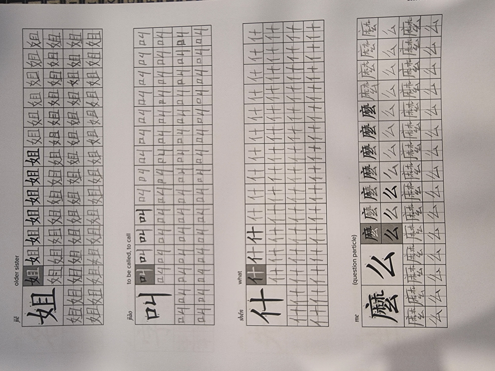
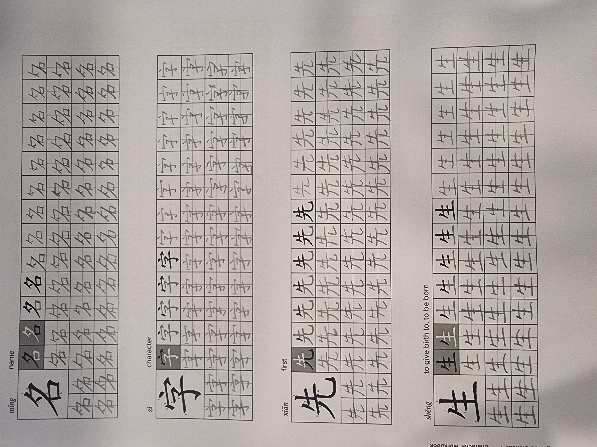
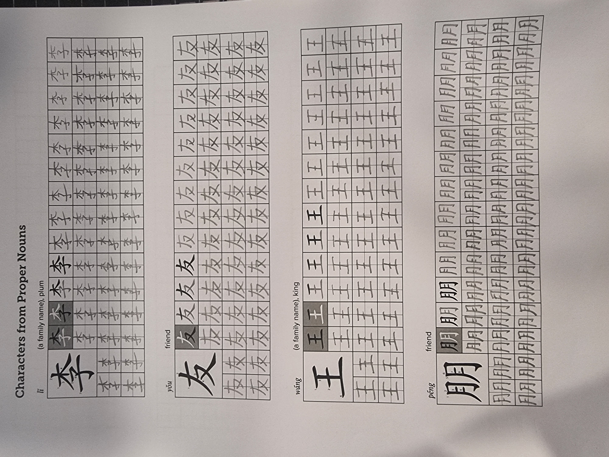

# Homework 2

## Review Vocabulary (Textbook p.24)

Go over the Dialogue 1 vocabulary we’ve covered so far. Please read the words ALOUD to practise pronunciation. You may also use the attached character writing sheets for handwriting practice.

## Read Grammar 1-3 (Textbook p 25-27)

You may find that some usage patterns become clearer after reading them carefully.

## Listening Task – Numbers

Listen to the attached audio recording and write down the numbers you hear.

??? Answers
    1. 80368759
    2. 23514595

## Writing Task

Link to this week's [writing task](./homework_2_files/L1D1.pdf)

Below are pictures of the completed writing task.

