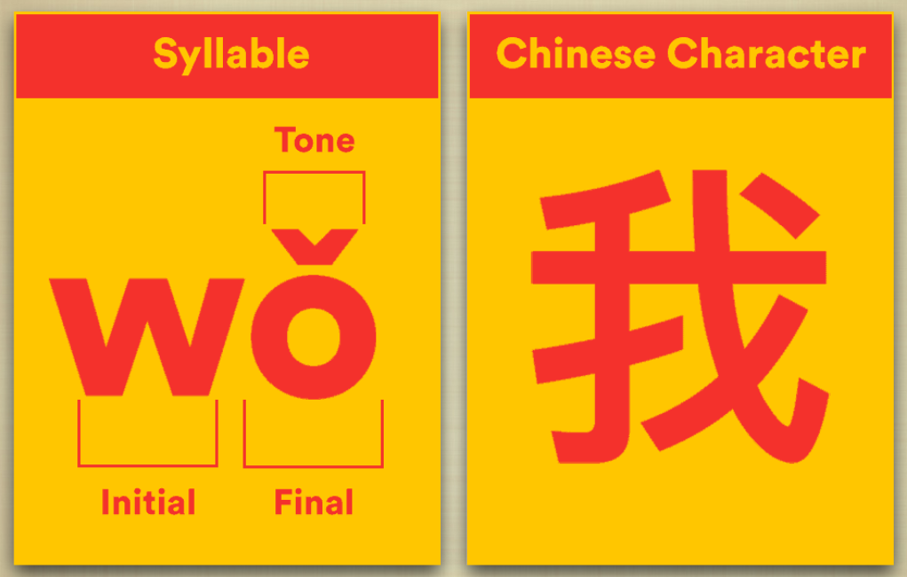
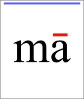
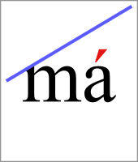
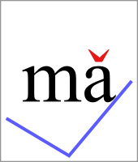
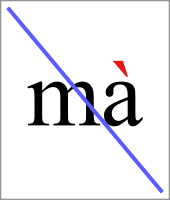
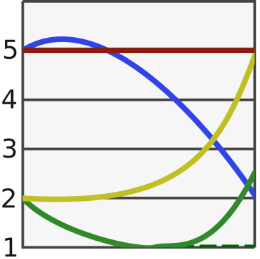
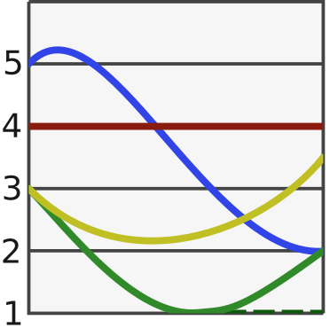

# Lesson 1

Lesson date: 27/01/2026 (Thursday)

Lesson time: 6:30pm to 8:30pm

Lesson was held on a zoom session.

Lecture slides [link](./lesson_1_files/W1_slides.pdf)

Google classroom [link](https://classroom.google.com/u/1/c/ODQxNDc5MDkzMzI5)

YouTube [link](https://www.youtube.com/watch?v=cG17tHgRlSc) (1)
{ .annotate }

1. This is my own seperate recording using OBS. I am recording my screen. When publishing to YouTube I will keep it unlisted to protect the privacy of other students.

---

## Introduction

Course instructor is Dr Cheng-Wei Wang he teaches at both UNSW and USYD. He has a great interest in both the English and Chinese language.

His pages:
 
- [UNSW](https://www.unsw.edu.au/staff/cheng-wei-wang)
- [USYD](https://cce.sydney.edu.au/tutor/2325)

Dr Cheng-Wei Wang also recommends getting the following textbooks for the course.

- Integrated Chinese 1 Textbook
- Integrated Chinese 1 Workbook

Both textbook and workbook will be referenced in this course. Some sections will say what page number in which book.

!!! Note 

    It is my personal opinion that textbooks should be free. See the [link](https://from-a-to-remzi.blogspot.com/2014/01/the-case-for-free-online-books-fobs.html) for the case for free online books (FOBs). I believe I have found the books here:

    Textbook [link](https://www.cheng-tsui.com/sites/default/files/ic_1_tb_simplified4th_edition.pdf)
   
     Workbook [link](https://www.cheng-tsui.com/sites/default/files/ic1_wb_simp_4e_disability_request_fm-l3.pdf)

    I have also downloaded the PDFs separately for this website as well.

---

## Chinese "Characters"

Characters/Morphemes are monosyllabic (1)
{ .annotate }

1. Monosyllabic means having only one syllable. [wiki link](https://en.wikipedia.org/wiki/Monosyllable)

For example: 


| | | | | 
| -- | -- | -- | --- |
| nǐ | hǎo | <div style="color: green;"> xué </div> | <div style="color: purple;"> Zhōng wén </div>|
| 你, | 好, | <div style="color: green;"> 学, </div> | <div style="color: purple;"> 中文 </div>|
| you, | good, | <div style="color: green;"> learn, </div> | <div style="color: purple;"> Chinese </div>|
|  |  |  |  |

<!---
### pronounication

| | |
|-|-|
| nǐ |  |
| hǎo |  |
| xué |  |
| Zhōng wén |  | 

-->

Chinese character are morphologically and syntactically analytic while with no <span style="color: red;">inflection</span>


| | | | |
| - | - | - | - |
| wǒ | <span style="color: green">xué</span> | <span style="color: purple">zhōng wén</span>|
| 我 | <span style="color: green">学</span> | <span style="color: purple">中 文。</span>| I <span style="color: green">study</span> <span style="color: purple">Chinese.</span>|
| | | | |

| | | | |
| - | - | - | - |
| tā | <span style="color: green">xué</span> | <span style="color: purple">zhōng wén</span>|
| 她 | <span style="color: green">学</span> | <span style="color: purple">中 文。</span>| She <span style="color: green">stud</span><span style="color: red">ies</span> <span style="color: purple">Chinese.</span>|
| | | | |

| | | | | |
| - | - | - | - | - |
| nǐ | <span style="color: green">xué</span> | <span style="color: purple">zhōng wén</span>| <span style="color: blue">ma?</span>|
| 你 | <span style="color: green">学</span> | <span style="color: purple">中 文</span>| <span style="color: blue">吗</span>| Do you <span style="color: green">study</span> <span style="color: purple">Chinese?</span>|
| | | | | |


Interestingly - Google translate will use Xuexi instead of Xue. 

| | | |
|-|-|-|
|学习|xuéxí| |
|学|xué| |

Chinese is a ==tonal language==. For example: shuǐjiǎo (dumpling) :dumpling: vs shuìjiào (sleep) :bed: :zzz:. Another example would be mǎi (buy) vs mài(sell)

| | | | |
|-|-|-|-|
|水饺|shuǐjiǎo|dumpling|  |
|睡觉|shuìjiào|sleep|  |
|买|mǎi|buy|  |
|卖|mài|sell|  |

!!! info
    1. Google translate will use a different word for dumpling. Jiǎozǐ (饺子). However both jiǎozǐ (饺子) and shuǐjiǎo (水饺) are considered correct translations. Jiǎozǐ (饺子) is a general term for dumpling. It can be boiled, steamed or pan-fried. Shuǐjiǎo (水饺) literally means "water dumpling". It refers specifically to boiled dumplings.
    <br>
    <br>
    饺子 = Jiǎozǐ  = dumpling 
    ---
    2. If you put mǎi and mài together then it will indicate business (Literally meaning "buy sell"). When we say "do business" in chinese it is "zuò mài mài” (做买卖)".
    <br>
    <br>
    做买卖 = zuò mài mài = Doing business 
    <br>
    买卖 = mǎi mài = buying and selling 
    --- 
    3. Context can help solve ambiguity. For example it does not make sense to say "I am going to dumpling" vs "I am going to sleep". But it is important to be deliberate and precise with your tone as it changes the meaning of a word. An english example would be [coke vs cock](https://www.youtube.com/shorts/_Hw6yZgvYR4) or sheet vs shit. 

--- 

## Hanyu Pinyin (拼音)

- ^^Pinyin (拼音)^^ is a way to represent and express the sounds of Chinese characters using 25 English letters
    - The character that is not used is "v" for any native sound. Some keyboard for chinese on computers use "v" as a placeholder for ü.
- Once you learn ^^Pinyin^^ you will know how to pronounce a character/word in Chinese and be able to type characters on electronic devices
- Although Pinyin and English both use Roman alphabets, the sounds they represent can vary  {== WIDELY ==}
- There are 3 parts in <b>Pinyin</b> to represent a pronunciation of a Chinese character: 
    1. <span style="color: red;">Initial</span> (Consonant)
    2. <span style="color: red;">Final</span> (Vowel + ending consonant)
    3. <span style="color: red;">Tone</span>

Example



---

## 36 Finals/vowels Simple Finals (p.2)

Textbook reference page: 2

| vowel | English approximation | audio |
|-|-|-| 
| a | Like "<b>ah</b>" in "father" | |
| o | Round, like "<b>or</b>" but shorter | |
| <span style="color: red;">e</span> | Similar to <b>uh</b>, not like english "e"| |
| i | Like "<b>ee</b>" in "see" | |
| <span style="color: red;">u</span> | Like "<b>oo</b>" in "food" | |
| <span style="color: red;">ü(v)</span> | Lips rounded "<b>ee</b>" (French "u") | |

The ones in red indicate different sounds to English. The red ones are semi-vowels.

### Instructor quiz

During the session Dr Cheng-Wei Wang gave us a small quiz. All words are in first tone (flat tone).

| quiz | English approximation | answer |
|-|-|-|
| ne | Like "nuh" with a high, steady pitch | |
| le | Like "luh" high and level | |
| he | "huh" but back of throat, high pitch | |
| she | "shuh" retroflex, high pitch | |
| wu | "oo" like in "food", high pitch | |
| tu | "too" with aspirated t, high pitch | |
| hu | "hoo" with back of throat, high pitch | |
| lü | "lee" with lips rounded, high pitch | |
| nü | "nee" with lips rounded, high pitch | |


### External link
- [ Master Chinese Vowels - "i, u, ü, a, o" | Pronunciation Training ](https://www.youtube.com/watch?v=NVAJT-Itj00)
 
---

## 21 Initals and consonants (p.3)

textbook reference page: 3

|1| | | | | 
|-|-|-|-|-|
| b | p | m | f | /ending with (u)o/|
| | | | | | 
|<b>2</b>| | | | |
| d | t | n | l | /ending with e/|
| | | | | |
|<b>3</b> | | | | |
| g | k | h | | /ending with e/|
| | | |
|<b>4</b> |
| <span style="color: red;">j</span> | <span style="color: red;">q</span> | <span style="color: red;">x</span> | | /like FLAT jee, chee, shee/|
| | | |
| <b>5</b> |
| z "tszz" | <span style="color: red;">c (ts)"ts-hh"</span> | s | |/c is like "ts" from cats/ |
| | ||
| <b>6</b> |
| <span style="color: red;">zh "jerk"</span> | <span style="color: red;">ch "chirp"</span> | <span style="color: red;">sh "Shirley"</span> | <span style="color: red;">r "voiced Shirley"</span> | 
|  |  |  | |


!!! important
     In zi, ci, si, zhi, chi, shi, ri, the vowel is NOT /i/ like English "see". There is no e sound
    <br>
    <br>
    zi
    
    <br>
    ci
    
    <br>
    si
    
    <br>
    zhi
    
    <br>
    chi
    
    <br>
    shi
    
    <br>
    ri
    


---

## Compound Finals (p.7)

Textbook reference page: 7

Compound finals means that we combine two finals to create a new sound.


| | | | | | |
|-|-|-|-|-|-|
|1.| ai | ei | ao | ou |
| | | | | | |
| | | | | | |
|2.| <span style="color: orange;">an</span> | en | <span style="color: orange;">ang</span> | eng | ong |
| | | | | | |
| | | | | | |
|3.| ia | iao | ie | <span style="color: red;">iu (=iou) </span> |
| | | | | | | 
| | <span style="color: green;">ian</span> | <span style="color: blue;">in</span> | <span style="color: green;">iang</span> | <span style="color: blue;">ing</span> | iong |
| | | | | | |
| | | | | | |
|4.| ua | uo | uai | <span style="color: red;">ui (=uei)</span>|
| | | | | | |
| | <span style="color: purple;">uan</span> | <span style="color: red;">un (=uen)</span> | <span style="color: purple;">uang</span> | ueng |
| | | | | | |
| | | | | | |
|5.| <span style="color: brown;">üe</span> | <span style="color: brown;">üan</span> | <span style="color: brown;">ün</span> |
| | | | | | |
| | | | | | |
|6.| er |
| | | 


ao is like the first part of "ouch"

an start with mouth open.

ang is shorter than an. with ang, tongue stays down.

### Instructor quiz

| word | audio |
|-|-|
| han | 
| hang | 
| ban | 
| bang | 
| liu | 
| lie | 
| liao | 
| lia | 
| lüe | 
| lüan | I cannot find an audio file for this.
| luan | 


---

## Tones

Textbook reference page: 9-10

First tone is steady, high and flat. It feels calm and is like singing.

Second tone is rising. From low to high. It feels like asking "huh?" or "what?"

Third tone is low/dipping. It goes low -> lower -> rise. It feels thoughtful, hesitant.

Fourth tone is sharp drop/fall. It starts high -> sharp drop. It feels strong, decisive and sometimes angry.

Fifth tone is called the neutral tone. It is light and unstressed. It sounds short, soft, no fixed pitched. It feels casual.

| first tone | second tone | third tone | fourth tone | neutral tone |
|-|-|-|-|-|
|mā|má|mǎ|mà|ma|
| | |||
|玛|麻|马|骂|吗|
| mother | hemp | horse | rebuke | Y/N Qs indicator |
||||

Different regions may have slightly different tones - but this is considered as an accent.

<div class="grid" markdown>

Beijing tones


Taipei tones


</div>

---

## Spelling rules (p.8)

Textbook reference page: 8

- <b>ueng</b> is written as <b>ong</b> if preceded by an initial, e.g., <b>tong, dong, nong, long</b>. Without an initial, it is <b>weng</b>.
- To avoid confusion, an apostrophe is used to separate two syllables with connecting vowels, e.g., <b>nǚ'ér</b> (daughter) and the city <b>Xī'ān</b> (<b>nǚ</b> and <b>ér</b>, <b>Xī</b> and <b>ān</b> are separate syllables). Sometimes an apostrophe is also needed even if the two syllables are not connect by vowels, e.g., <b>fáng'ài</b> (to hinder) and <b>fāng'àn</b> (plan; scheme).

|word | audio |
|-|-|
|ueng| |
|ong | |
|tong| |
|dong| |
|nong| |
|long| |
|weng| |
|nǚ'ér| |
|Xī'ān| |
|fáng'ài| |
|fāng'àn| |

### Spelling rules continued (p.5)

Textbook reference page: 5

The finals that can be combined with <b>j</b>, <b>q</b>, and <b>x</b> are limited to <b>i</b> and <b>ü</b> and compound finals that start with <b>i</b> or <b>ü</b>. When <b>j</b>, <b>q</b>, <b>x</b> are combined with <b>ü</b> (or a compound final starring with <b>ü</b>), the ^^umlaut is omitted and appears as a u^^. For example, <b>jü</b>, <b>qüe</b> and <b>xüan</b> become <b>j<span style="color: red;">u</span></b>, <b>q<span style="color: red;">u</span>e</b> and <b>x<span style="color: red;">u</span>an</b>.

| word | audio |
| - | - |
| jü | |
| qüe | |
| xüan | |
| ju | |
| que | |
| xuan | |

---

## Online Pinyin Table

As English and Chinese have very different phonetic systems, What you see is not what you get. When you are note sure how to pronounce certain combinations, the following website and app may help you (with the choice of four tones).

Website: [https://chinese.yabla.com/chinese-pinyin-chart.php](https://chinese.yabla.com/chinese-pinyin-chart.php)

Mobile App: Pleco, Pinyin Coach

??? note
    One mobile app that I would recommend is duolingo - but yes the ads on that app are shit.

---

## Numbers (p. 20)

Textbook reference page: 20

| líng | yī | èr | sān | sì | wǔ | 
|-|-|-|-|-|-|
| 〇| 一 | 二 | 三 | 四 | 五 |
| 0 | 1 | 2 | 3 | 4 | 5 |
|  |  |  |  |  |  |   
| | | | | | 
| <b>liù</b> | <b>qī</b> | <b>bā</b> | <b>jiǔ</b> | <b>shí</b> | <b>shíyī</b>
| 六 | 七 | 八 | 九 | 十 | 十一 |
| 6 | 7 | 8 | 9 | 10 | 11 |
|  |  |  |  |  | 

6 can be pronounced as liou.

9 can be pronounced as jiou. 

o is omitted in the spelling.

The recommendation is to only look at the written symbols since on the exam there won't be pronunication guides.

external resource: 

- 1-10 counting [short](https://www.youtube.com/watch?v=kNKlMfvbVT4)
- 1-10 counting [long](https://www.youtube.com/watch?v=qJGNPH1rxiQ)
- 11-99 counting [link](https://www.youtube.com/watch?v=9v2zBVThE70)

---

## Short greeting phrases

```
A: 你 好 (Hello)
   Nǐ hǎo
   literally means "You good"

B: 你 好 (Hello)
   Nǐ hǎo

A: 你叫什么名字？
   Nǐ jiào shénme míngzì?
   You (are) called what name?

B: 我叫 (your given name). (My name is _)
   Wǒ jiào _
   I (am) called _.
```

|Chinese|characters|audio|
|-|-|-|
|你好|Nǐ hǎo|  |
|你叫什么名字？|Nǐ jiào shénme míngzì?| |
|我叫| Wǒ jiào | |

---

## Final remarks

How to say "Thank you" and bye bye.

| text | chinese | pinyin | audio |
|-|-|-|-|
| Thank you |谢谢 |Xièxiè | 
| Bye | 再见 | Zàijiàn | 

Also just saying "Bye bye" is also acceptable/informal way of saying bye. Zàijiàn is more formal on saying bye/"I don't know when I will see you again".

Thank you: [ Stop Saying "Shie Shie"! Fix Your Chinese "X" Sound Instantly (The Physics Trick) ](https://www.youtube.com/watch?v=C_eFldgkrG0)


### Extra resources I found helpful

- [ How to Pronounce Chinese Pinyin "R" (Rén) Correctly | Vocal Coach Tips ](https://www.youtube.com/watch?v=rLxI2PDnVog)
- [ The "Spoon Trick": Fix Chinese "zh" vs "j" in 2 Minutes (Vocal Physics) ](https://www.youtube.com/watch?v=pK3hrtOLOdA)
- [ Fix Your Chinese “Z” in 30 Seconds | Learn Real Chinese with One Song ](https://www.youtube.com/watch?v=561xQMuevWY)
- [ How to Pronounce the Chinese ü Sound (yú, yǔ, qù, yù) | Big Fish Song Example ](https://www.youtube.com/watch?v=c19kRPTeRGk)
- [ Stop Pronouncing Chinese ‘e’ Like English (The 10-Second Fix) ](https://www.youtube.com/watch?v=K_qvJSvyJk0)
- [ Stop Saying "Shie Shie"! Fix Your Chinese "X" Sound Instantly (The Physics Trick) ](https://www.youtube.com/watch?v=C_eFldgkrG0)


- [ Master Chinese Tones | Pronunciation Training ](https://www.youtube.com/watch?v=n_Cj3aOSI1w)
- [ Master Chinese "zh ch sh r" | Pronunciation Training ](https://www.youtube.com/watch?v=dpQ3IMd4AMg)
- [ Master Chinese “j q x” and “zh ch sh” | Pronunciation Training ](https://www.youtube.com/watch?v=05BMKdxHjp8)
- [ Master Chinese Pronunciation - "en eng / in ing / an ang” ](https://www.youtube.com/watch?v=4x51--A625g)
- [ Master Chinese Vowels - "i, u, ü, a, o" | Pronunciation Training ](https://www.youtube.com/watch?v=NVAJT-Itj00)

