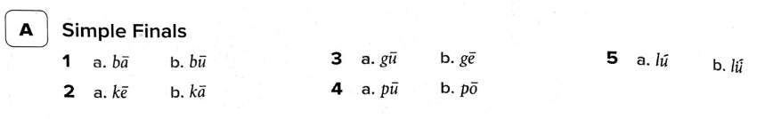
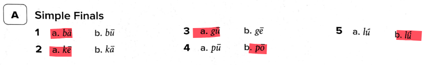
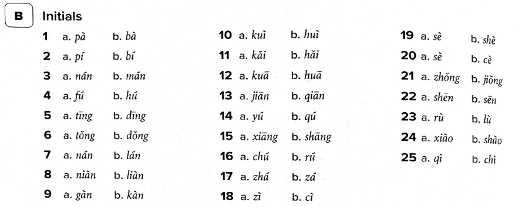
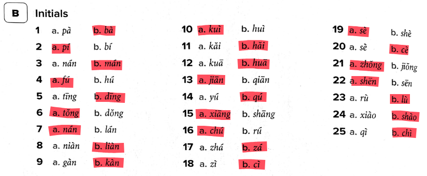
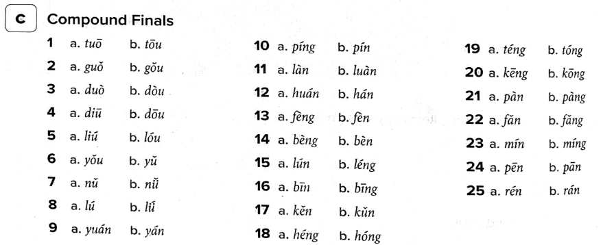
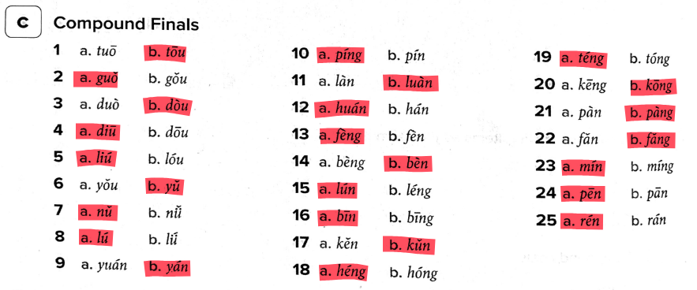
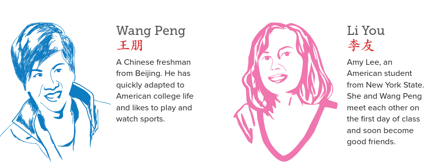

# Lesson 2

Lesson date: 3/02/2026 (Thursday)

Lesson time: 6:30pm to 8:30pm

Lesson was held on a zoom session.

Lecture slides [link](./lesson_2_files/W2_slides.pdf)

Google classroom [link](https://classroom.google.com/u/1/c/ODQxNDc5MDkzMzI5)

YouTube [link](https://www.youtube.com/watch?v=EPULX7mjDtg)

--- 

## Review of last lesson (lesson 1) - Unique sounds and tones

### Vowels

Textbook reference page: 2

| vowel | English approximation | audio |
|-|-|-| 
| a | Like "<b>ah</b>" in "father" | |
| o | Round, like "<b>or</b>" but shorter | |
| e | Similar to <b>uh</b>, not like english "e"| |
| i | Like "<b>ee</b>" in "see" | |
| u | Like "<b>oo</b>" in "food" | |
| ü(v) | Lips rounded "<b>ee</b>" (French "u") | |

The ones in red indicate different sounds to English. The red ones are semi-vowels.

---

### 21 Initials/consonants

Textbook reference page: 3

|1| | | | | 
|-|-|-|-|-|
| b | p | m | f | /ending with (u)o/|
| | | | | | 
|<b>2</b>| | | | |
| d | t | n | l | /ending with e/|
| | | | | |
|<b>3</b> | | | | |
| g | k | h | | /ending with e/|
| | | |
|<b>4</b> |
| j | q | x | | /like FLAT jee, chee, shee/|
| | | |
| <b>5</b> |
| z "tszz" | c (ts)"ts-hh" | s | |/c is like "ts" from cats/ |
| | ||
| <b>6</b> |
| zh "jerk" | ch "chirp" | sh "Shirley" | r "voiced Shirley" | 
|  |  |  | |

---

### Compound Finals

Textbook reference page: 7

Compound finals means that we combine two finals to create a new sound.

| | | | | | |
|-|-|-|-|-|-|
|1.| ai | ei | ao | ou |
| | | | | | |
| | | | | | |
|2.| an | en | ang | eng | ong |
| | | | | | |
| | | | | | |
|3.| ia | iao | ie | iu (=iou)  |
| | | | | | | 
| | ian | in | iang | ing | iong |
| | | | | | |
| | | | | | |
|4.| ua | uo | uai | ui (=uei)|
| | | | | | |
| | uan | un (=uen) | uang | ueng |
| | | | | | |
| | | | | | |
|5.| üe | üan | ün |
| | | | | | |
| | | | | | |
|6.| er |
| | | 

The ones that are coloured can be tricky. 

---

#### an / ang

- an :material-arrow-right: “ahn” (open, longer)
- ang :material-arrow-right: “ahng” (shorter, nasal)

--- 

#### ian / iang

- ian :material-arrow-right: “ee-en” (fast, but 2 parts) 
  :warning: can resemble “yen”, but don’t think of it as one sound
- iang :material-arrow-right: “ee-ahng” 
  (like “yang”, but tighter start)

---

#### uan / uang

- uan :material-arrow-right: “oo-ahn” / “wahn”
- uang :material-arrow-right: “oo-ahng” / “wahng”

---

#### en / eng

- en :material-arrow-right: "uh-n"
- eng :material-arrow-right: "uh-ng"

<b>Examples:</b>

- hen 很 :material-arrow-right: “huhn” (3rd tone)
- ben 本 :material-arrow-right: “buhn”
- heng 横 :material-arrow-right: “huhng” 

---

#### uai
- uai :material-arrow-right: "why"  
    (basically <b>wai</b>)

---

#### ui 
- ui :material-arrow-right: "way" (short, tight)

<b>Examples:</b>

- dui 对 :material-arrow-right: “dway”
- gui 贵 :material-arrow-right: “gway”

---

### Tones

Textbook reference page: 9-10

First tone is steady, high and flat. It feels calm and is like singing.

Second tone is rising. From low to high. It feels like asking "huh?" or "what?"

Third tone is low/dipping. It goes low -> lower -> rise. It feels thoughtful, hesitant.

Fourth tone is sharp drop/fall. It starts high -> sharp drop. It feels strong, decisive and sometimes angry.

Fifth tone is called the neutral tone. It is light and unstressed. It sounds short, soft, no fixed pitched. It feels casual.

| first tone | second tone | third tone | fourth tone | neutral tone |
|-|-|-|-|-|
|mā|má|mǎ|mà|ma|
| | |||
|玛|麻|马|骂|吗|
| mother | hemp | horse | rebuke | Y/N Qs indicator |
||||

---

## Common Expressions

Textbook page reference: 19-20

    你
    Nǐ

    好
    hǎo

You good (Hello)

    谢
    Xiè

    谢
    xie

Thank thank (Thank you)

Second xie becomes neutral tone. Neutral tone is like a very quick drop.

    不
    Bù

    好
    hǎo

    意
    yì

    思
    si

Not good feeling (Excuse me)

    对
    Duì

    不
    bù

    起
    qǐ

toward not worth of (Sorry)

    再
    Zài

    见
    jiàn

again meet (See you again)

    有
    Yǒu

    没
    méi

    有
    yǒu

    问
    wèn

    题
    tí

Is there a problem? (Are there any questions?)

    我
    Wǒ

    没
    méi

    有
    yǒu

    问
    wèn

    题
    tí

I have no problem (I don't have any questions)

---

## Numbers

### Review of Numbers (0-10) 

It is a requirement to memorise chinese characters 0-10 without pinyin. It is also a requirement to be able to write out these chracters. It is recommended to do week 1 homework for this exercise.

#### Without Pinyin

| 〇 | 一 | 二 | 三 | 四 | 五|
| - | - | - | - | - | - |
| 0 | 1 | 2 | 3 | 4 | 5 |
|   |   |   |   |   |   |
| 六 | 七 | 八 | 九 | 十 | 十一 |
| 6 | 7 | 8 | 9 | 10| 11|

#### With Pinyin

??? "Click to reveal"
    | líng | yī | èr | sān | sì | wǔ | 
    |-|-|-|-|-|-|
    | 〇| 一 | 二 | 三 | 四 | 五 |
    | 0 | 1 | 2 | 3 | 4 | 5 |
    |  |  |  |  |  |  |   
    | | | | | | 
    | <b>liù</b> | <b>qī</b> | <b>bā</b> | <b>jiǔ</b> | <b>shí</b> | <b>shíyī</b>
    | 六 | 七 | 八 | 九 | 十 | 十一 |
    | 6 | 7 | 8 | 9 | 10 | 11 |
    |  |  |  |  |  | 

### Review of Numbers (0-99)

By memorising numbers 0-10, we can count to 0-99 in Chinese. Double digit numbers are pronounced by literally saying how many "tens" and how many "ones".

For example:

- 12 十二 (shí èr)
- 13 十三 (shí sān)
- 20 二十 (èr shí)
- 23 二十三 (èr shí sān)
- 34 三十四 (sān shí sì)
- 50 五十 (wǔ shí)
- 99 九十九 (jiǔ shí jiǔ)

### External resources
- [Counting to ten in Chinese with one hand](https://www.youtube.com/watch?v=kNKlMfvbVT4)
- [How to Count to 10 in Mandarin Chinese | Beginner Lesson 3 | HSK 1](https://www.youtube.com/watch?v=qJGNPH1rxiQ)
- [Counting from 11 to 99 in Mandarin Chinese | Beginner Lesson 8 | HSK 1 ](https://www.youtube.com/watch?v=9v2zBVThE70)

## Workbook

During the zoom session we then worked through the workbook exercises A, B and C.

The whole worksheet can be seen [here](../homework/homework_1_files/W1-5 Workbook P2-3 Pinyin practice.pdf) 

### A Simple Finals

??? "Answers"
    

### B Initials

??? "Answers"
    

### C Compound Finals

??? "Answers"
    

---

## Review: Asking for someone's name

  A:
  
    你
    Nǐ
  
  
    好
    hǎo
  
  You good. (Hello)

  B:
  
    你
    Nǐ
  
  
    好
    hǎo
  
  You good. (Hello)

  A:
  
    你
    Nǐ
  
  
    叫
    jiào
  
  
    什
    shén
  
  
    么
    me
  
  
    名
    míng
  
  
    字
    zì
  
  
    ?
  
  You (are) called what name? (What is your name?)

  B:
  
    我
    Wǒ
  
  
    叫
    jiào
  
  
    ______
  
  I (am) called ______. (My name is ______.)

!!! Note

    There is something called "Third Tone Sandhi". When two third tones are next to each other. The first one changes to second tone. e.g. 你好 nǐ hǎo → <b>ní hǎo</b>

---

## Vocab 1: What is your name? 

The list below is chinese characters that are used to ask for people's names as well as introduce yourself.

### 你 (nǐ) 

- {== Core meaning==}: You (single)

你

<b>External resource</b>

- [Ni: YOU](https://www.youtube.com/shorts/tbPnaxTK4Oo)
 
---

### 我 (wǒ) 

- {== Core meaning==}: I; me

我

<b>External resource</b>

- [Wǒ: I, ME](https://www.youtube.com/shorts/eossFSrHMi4)

---

### 好 (hǎo) 

- {== Core meaning==}: good
- Minimal acknowledgement, like YES, or Okay
- good, fine, as in 你好 (Nǐ hǎo)

好

!!! info "In terms of writing"
    好 is made of 女 (Nǚ)(woman) and 子 (Zǐ)(child). Originally, this pictured a woman with a child, which in early Chinese culture symbolized well-being, continuity, something going as it should.

<b>External resource</b>

- [Hǎo: GOOD](https://www.youtube.com/shorts/ikGHOMAEkMI)

---

### 请 (qǐng) 

- {== Core meaning==}: polite request/ invitation/ ask
- Please ..., May I ..., Would you please ...
- [Other Meanings] See Lesson 3 p.81
    - Treat and/or invite:
    - e.g. 我请你 (wǒ qǐng nǐ) + activity (Means I invite you to activity (e.g. having a dinner, coffee, or watching movies, etc)).

请

<b>External resource</b>

- [Qing: PLEASE](https://www.youtube.com/shorts/huS6Mt3_C78)

---

### 问 (wèn) 
- {== Core meaning==}: to ask/ inquire/ seek information
- [Combination]
    - 请问 (qǐng wèn) ...
    - May I ask ...
- [Cultural Note] 请问 (qǐng wèn) is used to politely start a question, especially to strangers.
- [Combination] 问好 (wèn hǎo): give one's regards to greetings (as we see the title of Lesson 1).

问

!!! info
    问题 (Wèntí) means "question". 问候 (Wènhòu) means "greetings".

<b>External resource</b>

- [Wen: TO ASK](https://www.youtube.com/shorts/DWqBrJihpZc)

--- 

### 叫 (jiào)
- {== Core meaning==}: to be called; to call
- [Example]
    - 我叫 Alex (“I am called Alex” → literally “I call (myself) Alex”)
    - 我叫彭王 (Wǒ jiào péng wáng)

叫

<b>External resource</b>

- [Jiao: TO CALL](https://www.youtube.com/shorts/UyyxaljK9Tk)

---

### 什么 (shén me)
- {== Core meaning==}: what
- What?
- WHAT!!
- [Note] 什么 (shénme) is a WH-question word meaning "what". It is very important and heard often in daily conversations.

什么

<b>External resource</b>

- [什么/shenme/(what)](https://www.youtube.com/watch?v=8oiZGbYrkJg)

--- 

### 名字 (míng zì)
- Means "name"
- {== Core meaning==}
    - 名 (míng): name, particularly given name
    - 字 (zì): a Chinese character
- [Example] {== Memorise it! ==}
    - 你 叫 什么 名字 (Nǐ jiào shénme míngzì) means "what is your name?"

名字

<b>External resource</b>

- [名字/mingzi/(name)](https://www.youtube.com/watch?v=CsAw7jspbSI)

---

### 贵 (guì) 

- {== Core meaning==} Honourable
- [Cultural Note]
    - 贵 (guì) means "honourable" or "precious" and is mostly used in formal or polite situations when referring to other people, especially to show respect.
- In daily life, 贵 (guì) means <b>{++Expensive++}</b> :moneybag::money_with_wings::money_with_wings::money_with_wings::moneybag: (See Lesson 9)

贵

!!! Note
    To say something is too expensive. 太贵了(Tài guì le)

<b>External resource</b>

- [贵/gui/(expensive)](https://www.youtube.com/watch?v=FM0JhzBDxvM)

---

### 姓 (xìng)
- {==Core meaning==} surname, family name
    - (one's) surname is ...
    - to be surnamed
- [Example]
    - Q: 你姓什么 (Nǐ xìng shénme) - What is your surname?
    - A: 我姓张 (Wǒ xìng zhāng) - My surname is Zhāng.
    - (Literally: Q: You are surnamed what? A: I am surnamed Zhāng)

- [Example] {== Fixed usage, memorise it!! ==}
    - 你贵姓 (Nǐ guìxìng)

- [Combination] 
    - 姓名 (Xìng míng): full name

??? Cultural Note
    In Chinese culture, the family name (last name) comes first, and the given name (first name) comes second.

姓

<b>External resource</b>

- [Xing: FAMILY NAME](https://www.youtube.com/shorts/hLZh3dLM2YU)

---

### 你贵姓 (nǐ guì xìng)
- What is your honourable surname?
- [Example]
    - A: 你贵姓 (Nǐ guì xìng)
    - B: 我姓王，叫王正威 (Wǒ xìng wáng, jiào wáng zhèng wēi)
- [Cultural Note]
    - This is a polite and formal way to ask someone's name, often used when meeting someone for the first time. While it literally asks for the surname, in many contexts it can be broadly understood as the speech act "What is your name?", especially when the speaker wants to be respectful.
- 你贵姓 (nǐ guì xìng) is also often used in customer service.

你贵姓

---

### 呢 (ne/nē)

- Question particle, usually for an open question, e.g. 你呢? (Nǐ ne) - How about you? 
- [Note] For Yes-No questions, usually use 吗 (ma) (see Dialogue 2).

呢

ne audio

你呢

ni ne audio

<b>External resource</b>

- [How to write 呢 (ne)](https://www.youtube.com/watch?v=lc4rFqWH5cI)

---

### 王 (wáng) & 李 (lǐ)

- Two very common family names
- [Core meaning]
    - 王 (wáng): king
    - 李 (lǐ): plum

王

李

---

### 小姐 (xiǎo jiě)
- Miss/Ms; Young lady
- [Pattern] Family Name +  小姐 (xiǎojiě)
    - Ms Wang = 王小姐 (wáng xiǎojiě)
- [Example] 
    - 李小姐，你好。(Lǐ xiǎojiě, nǐ hǎo.) - “Miss Li, hello."
- [Core Meaning]
    - 小 (xiǎo): small
    - 姐 (jiě): older sister

小姐

??? warning "Cultural note"
    In mainland China, especially in informal or certain adult contexts, “小姐” (xiǎoi jiě) is often used as a code word for prostitutes or sex workers. In mainland china, the accepted term is 小姐姐 (xiǎo jiě jiě). In daily life, people say 小姐姐 (Xiǎo jiě jiě) to indicate young lady.

---

### 先生 (xiān sheng/shēng)

- Mr.;husband; teacher (old way)
- [Pattern] Family name + 先生 (xiānshēng)
    - Mr Wang = 王先生 (wáng xiānshēng)
- [Example]
    - 王先生, 你叫什么名字 (wáng xiānshēng, nǐ jiào shénme míngzì) 
    - Mr. Wang, what is your name?
        - This question makes sense because we only know the family name. We don't know the full name.
- [Core Meaning]
    - 先 (xiān): ahead, before, earlier, first, or in advance
    - 生 (shēng): birth

先生

<b>External resource</b>
- [Xiansheng：Sir, Mr](https://www.youtube.com/shorts/BMM51LHA1_c)

!!! Note
    先生 can also mean Gentlemen.

---

## Introduction to Integrated Chinese characters

- [Combination]
    - 朋友 (péng yǒu): can be put together to mean "friend". For example:
        - 
    - 好朋友 (hǎo péng yǒu): good friend
        - 
    - 小朋友 (xiǎo péng yǒu): small friend :material-arrow-right: child, children, kids
        - 

王朋

(Wáng péng)

李友

(Lǐ yǒu)

---

## Dialogue 1 Exchanging Greetings

### Asking of someone's name

Full audio

  A:
  
    你
    Nǐ
  
  
    好!
    hǎo
  
  You good. (Hello)

  B:
  
    你
    Nǐ
  
  
    好!
    hǎo
  
  You good. (Hello)

  A:
  
    请
    qǐng
  
  
    问,
    wèn
  
  
    你
    nǐ
  
  
    贵
    guì
  
  
    姓?
    xìng?
  
  May I ask, what is your surname?

  B:
  
    我
    wǒ
  
  
    姓
    xìng
  
  
    李
    lǐ
  
  
    你
    nǐ
  
  
    呢
    ne
  
  My surname is Li. What about you?

  A:
  
    我
    Wǒ
  
  
    姓
    xìng
  
  
    王.
    wáng.
  
  
    李
    Lǐ
  
  
    小
    xiǎo
  
  
    姐,
    jiě,
  
  
    你
    nǐ
  
  
    叫
    jiào
  
  
    什
    shén
  
  
    么
    me
  
  
    名
    míng
  
  
    字?
    zì?
  
  My surname is Wang. Miss Li, what is your name?

  B:
  
    我
    Wǒ
  
  
    叫
    jiào
  
  
    李
    lǐ
  
  
    友。
    yǒu.
  
  
    王
    Wáng
  
  
    先
    xiān
  
  
    生,
    shēng,
  
  
    你
    nǐ
  
  
    叫
    jiào
  
  
    什
    shén
  
  
    么
    me
  
  
    名
    míng
  
  
    字?
    zì?
  
  My name is Li You. Mr. Wang, what is your name?

  A:
  
    我
    Wǒ
  
  
    叫
    jiào
  
  
    王
    wáng
  
  
    朋。
    péng.
  
  My name is Wang Peng.

--- 

