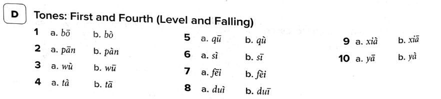
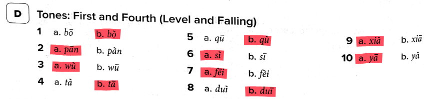
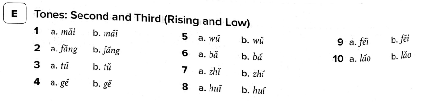
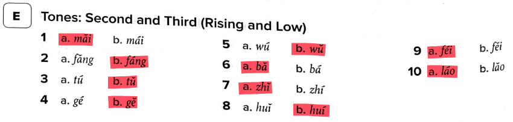
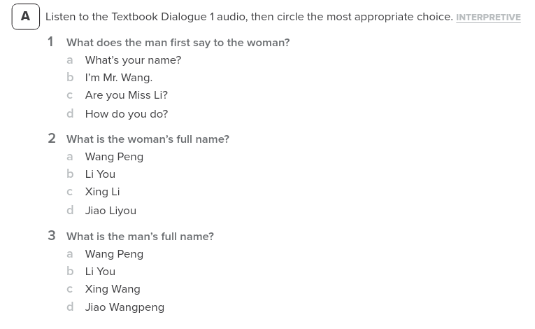
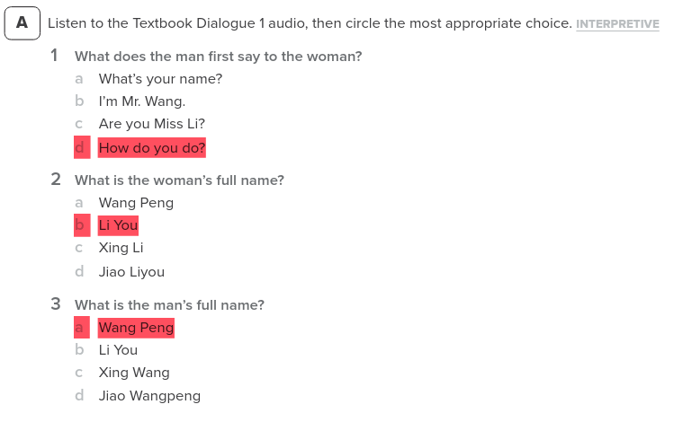
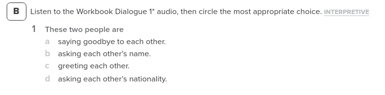
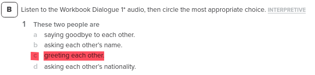
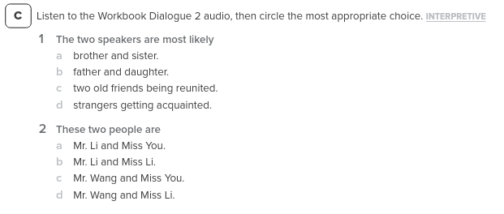
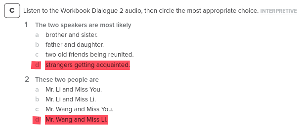

# Lesson 3

Lesson date: 10/2/2026 (Thursday)

Lesson time: 6:30pm to 8:30pm

Lesson was held on a zoom session

Lecture slides [link](./lesson_3_files/W3_slides.pdf)

Google classroom [link](https://classroom.google.com/u/1/c/ODQxNDc5MDkzMzI5)

YouTube [link](https://www.youtube.com/watch?v=ueVYjqxeUlg)

---

## Chinese Classroom greetings

Teacher calls students "classmates".

同学 = (Tóngxué) classmates

student = xuesheng

晚上 = Evening

晚上好 = Good Evening

## Homework 2 listening task:

Homework 2 Audio

The answers are: 

1. 80368759
2. 23514595

## Spelling Rules

Page 5 and page 8

The issues comes from point 5.

4. ueng is written as ong if preceded by an initial, e.g., tong, dong, nong. long. Without an initial, it is weng.

ueng audio:

ong audio:

5. To avoid confusion, as apostrophe is used to separate two syllables with connecting vowels,

Sometimes an apostrophe is also needed even if the two syllables are not connect by vowels.

nu -> means female.

j, q, and x are never combined with wuu sound.

## Workbook

During the session we then went through Exercises D and E in the workbook.

### D Tones: First and Fourth (Level and Falling)

### D Answers

??? "Click to reveal"
    

### E Tones: Second and Thrid (Rising and Low)

### E Answers

??? "Click to reveal"
    

## Stroke Order (p.17)

- from left to right
- from top to bottom
- Horizontal before vertical
- from outside to inside
- middle before two sides
- Inside before closing

- Mobile App: Chinese Stroke Order Writing

## Basic Radicals
- Basic components to write characters.

## Quick review of the vocabulary

basically same as [lesson 2](./lesson_2.md/#chinese-characters)

sho si - quick break

After break
- dialogue + workbook

## Dialogue practice

It is recommended to be able to read the Dialogue without Pinyin.

    
        A:
    
    
        
            你好!
        
    

    
        B:
    
    
        
            你好!
        
    

    
        A:
    
    
        
            请问，你贵姓?
        
    

    
        B:
    
    
        
            我姓{++李++}。你呢？
        
    

    
        A:
    
    
        
            我姓{==王==}。{++李++}小姐，你叫什么名字?
        
    

    
        B:
    
    
        
            我叫李友。{==王==}先生，你叫什么名字？
        
    

    
        A:
    
    
        
            我叫王朋。
        
    

### With Pinyin

Pinyin can be seen in Lesson 2 [here](./lesson_2.md/#asking-of-someones-name)

### Audio of Dialogue

## Additional vocab

休息 - Xiūxí - break

## Workbook 

Workbook page reference [12](../workbook.pdf#page=21)

### Exercise A

Audio

Questions:

Answers:

??? "Click to reveal"
    

### Exercise B

Audio

Question

Answer

??? "Click to reveal"
    

### Exercise C

Audio

Questions

Answers

??? "Click to reveal"
    
