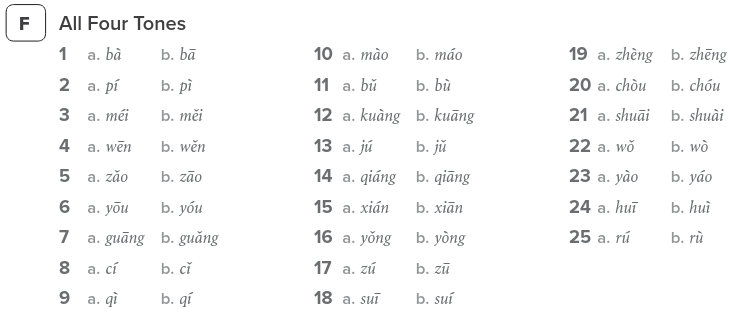
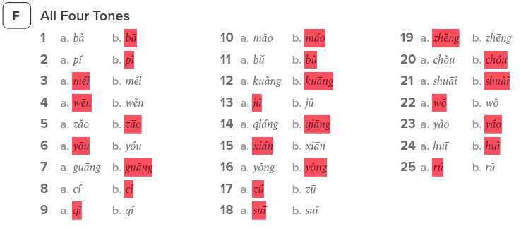
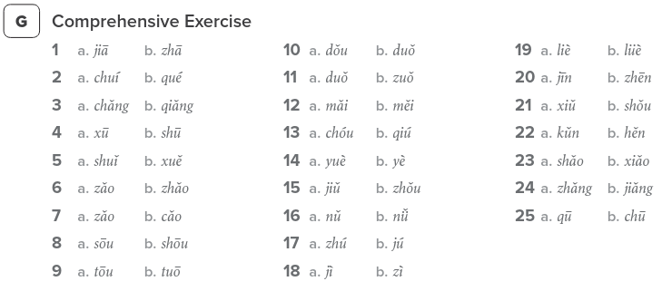
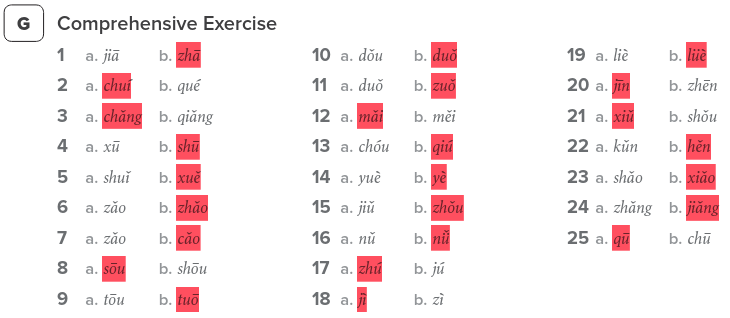

# Lesson 4

Lesson date: 17/02/2026

Lesson time: 6:30pm to 8:30pm

Lesson was held on a zoom session.

Lecture slides

Google classroom link

YouTube [link](https://www.youtube.com/watch?v=XoZeir5pNec)

---

## Chinese New Year

The session's date was held on Tuesday, 17th of February 2026 which is the first day of the Lunar New Year. 

Chinese Nes Year's Eve was on Monday 16th of February 2026 - Being half Chinese I had a family dinner.

This year was the year of the Horse :horse: .

新年快乐

    新
    xīn

    年
    nián

    快
    kuài

    乐
    lè

Xin Nian Kuai Le

Xin Nian = new year

Kuai le = happy

---

## Homework Feedback

- writing is important - do not rely on pinyin.

speaking - maintain tones

---

## Workbook

### F All Four Tones

### F Answers

??? "Click to reveal"
    

### G Comprehensive Exercise

### G Answers

??? "Click to reveal"
    

---

## Vocab 2: Where are you from?

Additional Dialogue and Vocab that was covered in the class. (From roughly the 56 minute mark in the YouTube video).

---

### 是 (shì)

- Be verb (i.e. am, are, is, was, were)
- [Example]
    - 
 
    
        你
        nǐ
    
    
        是
        shì
    
    Tarzan, 
    
        我
        wǒ
    
    
        是
        shì
    
    Jane。
    

是

<b>External resource</b>

- [Shi: TO BE](https://www.youtube.com/shorts/2uA8_qM037k)

---

### 老师 (lǎo shī)

- Teacher
- Example
    - 

    
        我
        wǒ
    
    
        是
        shì
    
    
        老
        lǎo
    
    
        师
        shī
    
    !
    

- {==Core Meaning==}
    - 
 
    
        老
        lǎo
    
    : old
    

    - 

    
        师
        shī
    
    : master
    

老师

<b>External resource</b>

- [Lǎoshī](https://www.youtube.com/shorts/5EpbQ3e2zjI)

---

### 学生 (xué shēng)

- Student
- Example
    - 

    
        我
        wǒ
    
    
        是
        shì
    
    
        学
        xué
    
    
        生
        shēng
    
    !
    

- {==Core Meaning==}
    - 

    
        学
        xué    
    
    : learn
    

学生

<b>External resource</b>

- [Xuéshēng](https://www.youtube.com/shorts/Ia-i2MTa5Vg)

---

### 吗 (ma)

- Question ending particle, usually for <b>Yes/No questions.</b>
- Example
    - 
 
    Q: 
        
            你
            nǐ
        
        
            是
            shì
        
        
            老
            lǎo
        
        
            师
            shī
        
        
        
            吗
            ma
        
        ?
        
        (Are you a teacher?)
    
 
    - 

    Ans (YES): 
         
            是
            shì
        
        ( or 
        
            对
            duì
        
        ) , 
        
            我
            wǒ
        
        
            是
            shì
        
        
            老
            lǎo
        
        
            师
            shī
        
        。
    

    - 

    Ans (NO):
        
            不
            bù
        
        
            是
            shì
        
        ,
        
            我
            wǒ
        
        
            是
            shì
        
        
            学
            xué
        
        
            生
            shēng
             
    

- Example
    - 

        
            王
            wáng
        
        
            先
            xiān
        
        
            生
            shēng
        
        
            是
            shì
        
        
            老
            lǎo
        
        
            师
            shī
        
        
            吗
            ma
        
        ? (Is Mr Wang a teacher?)
    

 
- Example
    - 

        Q:
        
            你
            nǐ
        
        
        
            姓
            xìng
        
        
        
            王
            wáng
        
        
        
            吗
            ma
        
        ?  
        (Are you surnamed Wang?) 
    

    - 

        A: 
        
            是
            shì
        
        ( or 
        
            对
            duì
        
        ) , 
        
            我
            wǒ
        
        
        
            姓
            xìng
        
        
        
            王
            wáng
        
        。(Yes, my surname is Wang) 
    

- Review
    - 

        
            呢
            ne
        
    

    - 

        
            你
            nǐ
        
        
            呢
            ne
        
        (And you)
    

    - "呢" (ne) is a Follow-up or Contextual Question Marker.

吗

<b>External resource</b>

- [ma](https://www.youtube.com/watch?v=7eMHx51ba1E)

---

break

workbook exercise

dialogue continued

---

### 中国 (zhōng guó)

- China :flag_cn:
- {==Core Meaning==}
    - 

         
            中
            zhōng
        
        : middle   
    

    - 

        
            国
            guó
        
        : country
    

    - 中国: Middle Kingdom

中国

<b>External resource</b>

- [Zhong guo：CHINA](https://www.youtube.com/shorts/vsGeA7VU92M)

---

### 北京 (běi jīng)

- Beijing
- {==Core Meaning==}
    - 

        
            北
            běi
        
        : north
    

     - 

        
            京
            jīng
        
        : capital of a country (old way)
    

北京

<b>External resource</b>

- [beijing](https://www.youtube.com/watch?v=qru2b45eo_8)

---

### 美国 (měi guó)

- America :flag_us:
- {==Core Meaning==}
    - 

        
            美
            měi
        
        : beautiful
    

!!! note 
    
    While 美 means "beautiful," 美国 specifically refers to the United States of America and literally translates to "Beautiful Country" or "Beautiful Nation." However, this is just a name and not a direct comment on the country's beauty.

美国

---

### 纽约 (niǔ yuē)

- New York
- Note
    - Pronunciation is hard.

纽约

<b>External resource</b>

- [New York](https://www.youtube.com/watch?v=G7I6qeQTO3Q)

---

### 人 (rén)

- person, people
- [Pattern] Put 人 after a country/place to form the people from that country/place. For example:
    - 中国 :material-arrow-right: 中国人 (China :material-arrow-right: Chinese) :flag_cn: 
    - 北京 :material-arrow-right: 北京人 (Beijing :material-arrow-right: Beijing-er)
    - 美国 :material-arrow-right: 美国人 (America :material-arrow-right: American)
    - 纽约 :material-arrow-right: 纽约人 (New York :material-arrow-right: New Yorker) 
- Example
    - 
 :koala: :flag_au:
        
            我 是
        
        
            
                澳
                ào
            
            
                大
                dà
            
            
                利
                lì
            
            
                亚
                yǎ
            
        
        
            人
        
        :flag_au: :kangaroo: (I am Australian) 
    
 
- [Pattern]
    - Asking someone's nationality or where s/he is from?
    - 你是 ^^nation/place/city^^ 人吗？

人

<b>External resource</b>

- [Ren](https://www.youtube.com/shorts/hxaTqPhNRmI)

---

### Country and place

This section is not that important it is more of a overview of various other places

- 英国 [Yīngguó] England; Britain :flag_gb:
- 法国 [Fàguó] France :flag_fr:
- 德国 [Déguó] Germany :flag_de:
- 意大利 [Yìdàlì] Italy :flag_it:
- 新西兰 [Xīnxīlán] / 纽西兰 [Niǔxīlán] New Zealand :flag_nz:
- 日本 [Japan] :flag_jp:
- 韩国 [Hánguó] South Korea :flag_kr:
- 泰国 [Tàiguó] Thailand :flag_th:
- 上海 [Shànghǎi] 

 

- 澳洲 [Àozhōu] / 澳大利亚 [Àodàlìyǎ] Australia :flag_au:
- 悉尼 [Xīní] Sydney
- 澳洲人 [Àozhōurén] Australian
- 悉尼人 [Xīnírén] Sydneysider

 

- 墨尔本 [Mò'ěrběn] Melbourne
- 布里斯班 [Bù lǐsī bān] Brisbane
- 堪培拉 [Kānpéilā] Canberra

!!! Note
    澳洲 is preferred over 澳大利亚 since it is shorter

澳洲

---

### 不 (bù)

- no; not
- [Pattern] Put 不 before a verb to express negation, for example:
    - 

        
            我
        
        
            
                不
                bù
            
        
        
            
                是
                shì
            
        
        
            
                老
                lǎo
            
            
                师
                shī
            
        
        ,
        
            我
        
        
            
                是
                shì
            
        
        
            
                学
                xué
            
            
                生
                shēng
            
        
        。 (I am not a teacher, I am a student)
    

    - 

        
            我
        
        
            
                不
                bù
            
        
        
            
                姓
                xìng
            
        
        
            李
            lǐ
        
        ,
        
            我
        
        
            
                姓
                xìng
            
        
        
            王
            wáng
        
        。 (I am not surnamed Li, I am surnamed Wang.)
    

- [Note] Pronunciation
    - 
        
            不
            bù
        
     is pronounced in a 2nd tone before a 4th tone character, for example:
    
        不
        bù
    
    
        是
        shì
    
,
    
        不
        bù
    
   
        叫
        jiào
    
,
    
        不
        bù
    
   
        姓
        xìng
    

---

## Dialogue

A: Are you American?

A: Are you Australian?

A: Are you Chinese?

A: Are you teacher li?

B: I am not teacher li, I am a student.
